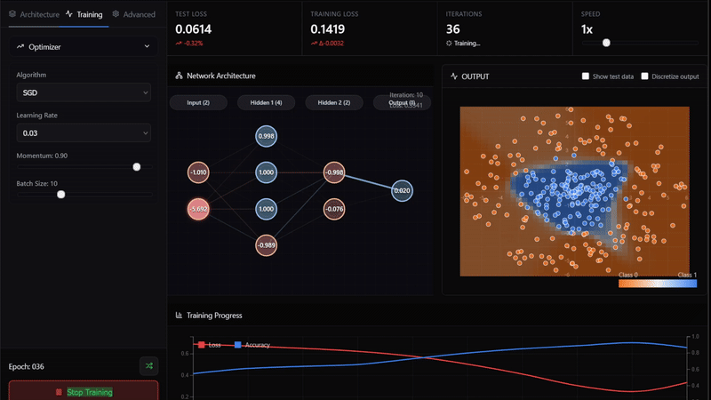
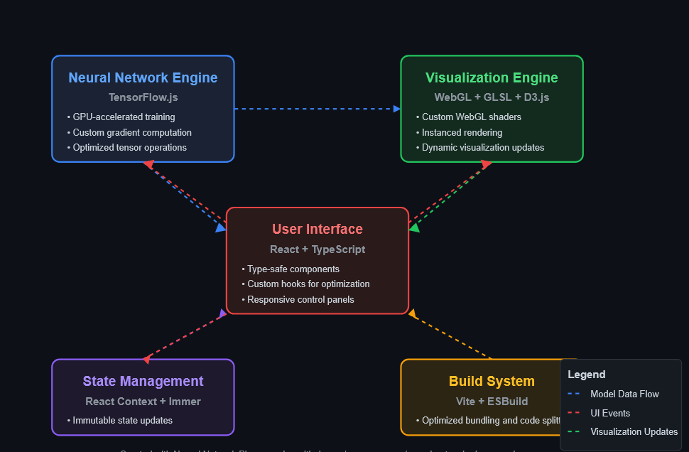

# Neural Network Playground

<div align="center">

[](https://www.tensorflow.org/js)
[](https://reactjs.org/)
[](https://d3js.org/)
[](https://www.typescriptlang.org/)
[](https://www.khronos.org/webgl/)
[](LICENSE)

**An advanced, interactive neural network visualization and training platform built with TensorFlow.js, React, and WebGL**

[Features](#features) • [Installation](#installation) • [Usage](#usage) • [Technical Details](#technical-implementation) • [Performance Optimizations](#performance-optimizations) • [Contributing](#contributing) • [License](#license)

</div>

## Overview

Neural Network Playground is a sophisticated, browser-based application that provides real-time visualization and experimentation with neural networks. Inspired by TensorFlow Playground but significantly enhanced, this tool renders the entire training process with WebGL acceleration, allowing users to gain deep intuitive understanding of neural network learning dynamics. The platform offers fine-grained control over network architectures, optimization algorithms, and hyperparameters with immediate visual feedback on performance metrics.

<div align="center">
  
</div>

## Features

<table>
<tr>
  <td width="50%">
    <h3>Advanced Visualization</h3>
    <ul>
      <li>WebGL-accelerated neuron and connection rendering</li>
      <li>Real-time decision boundary evolution with configurable resolution</li>
      <li>Interactive activation heatmaps throughout the network</li>
      <li>Dynamic gradient flow visualization during backpropagation</li>
      <li>Multi-dimensional weight matrix projections</li>
      <li>Progressive rendering for performance optimization</li>
    </ul>
  </td>
  <td width="50%">
    <h3>Comprehensive Network Configuration</h3>
    <ul>
      <li>Dynamic architecture manipulation via intuitive UI</li>
      <li>Layer-specific neuron count and activation configuration</li>
      <li>Advanced activation functions (ReLU, Leaky ReLU, SELU, Sigmoid, Tanh, Softmax)</li>
      <li>Multiple weight initialization strategies (Xavier, He, Normal, Uniform)</li>
      <li>Fine-grained learning rate scheduling with visual controls</li>
      <li>Batch normalization and dropout regularization</li>
    </ul>
  </td>
</tr>
<tr>
  <td width="50%">
    <h3>Diverse Dataset Options</h3>
    <ul>
      <li>Parametrized circle classification with adjustable separation</li>
      <li>N-dimensional XOR problem generalization</li>
      <li>Multi-class spiral datasets with controllable noise</li>
      <li>Gaussian mixture models with configurable variance</li>
      <li>Interactive data point manipulation</li>
      <li>CSV import functionality for custom datasets</li>
    </ul>
  </td>
  <td width="50%">
    <h3>Production-Grade Features</h3>
    <ul>
      <li>Real-time training metrics with customizable visualization</li>
      <li>Comprehensive regularization suite (L1, L2, Elastic Net)</li>
      <li>Advanced optimizers (SGD, Adam, RMSProp, AdaGrad, with momentum)</li>
      <li>Early stopping with validation set monitoring</li>
      <li>Model export to TensorFlow.js format and weight inspection</li>
      <li>Shareable configuration URLs for collaboration</li>
    </ul>
  </td>
</tr>
</table>

<div align="center">
  
  <p><i>Key features and capabilities of the Neural Network Playground</i></p>
</div>

## Installation

### Prerequisites

- Node.js 16.0 or higher
- npm 7.0 or higher
- Modern browser with WebGL 2.0 support

### Setup Instructions

<details>
<summary><strong>Standard Installation</strong></summary>

```bash
# Clone the repository
git clone https://github.com/yourusername/neural-network-playground.git
cd neural-network-playground

# Install dependencies
npm install

# Start the development server with hot reloading
npm run dev

# For production build
npm run build
npm run start

# Open http://localhost:3000 in your browser
```

</details>

<details>
<summary><strong>Docker Installation</strong></summary>

```bash
# Build the Docker image
docker build -t neural-network-playground .

# Development mode with volume mounting for hot reloading
docker run -p 3000:3000 -v $(pwd):/app neural-network-playground

# Production mode
docker run -p 3000:3000 -e NODE_ENV=production neural-network-playground

# Open http://localhost:3000 in your browser
```

</details>

## Usage

### Quick Start Guide

1. Select a dataset from the comprehensive dropdown menu in the top panel
2. Configure your neural network architecture:
   - Add or remove layers using the +/- buttons
   - Adjust neuron counts and activation functions per layer
   - Select appropriate initialization methods
3. Fine-tune hyperparameters in the side panel (learning rate, regularization, etc.)
4. Click "Start Training" to begin the optimization process
5. Monitor network performance through the multi-faceted visualization system:
   - Real-time WebGL rendering of neuron activations
   - High-resolution decision boundary overlay
   - Interactive loss landscape visualization
   - Precision-recall and ROC curves for classification tasks

### Advanced Usage

<details>
<summary><strong>Activation Functions</strong></summary>

The playground implements a complete suite of activation functions that significantly impact learning dynamics:

- **ReLU** (Rectified Linear Unit): Efficient default for hidden layers, mitigates vanishing gradient
- **Leaky ReLU**: Allows small negative values, preventing dead neurons
- **SELU** (Scaled Exponential Linear Unit): Self-normalizing, maintains mean and variance
- **Sigmoid**: Maps outputs between 0 and 1, useful for binary classification
- **Tanh**: Maps to [-1, 1], zero-centered with stronger gradients than sigmoid
- **Softmax**: Probability distribution output, ideal for multi-class tasks
- **Linear**: No activation, suitable for regression problems

The visualization system provides immediate feedback on how each activation function shapes the decision boundary and affects gradient flow.

</details>

<details>
<summary><strong>Regularization Techniques</strong></summary>

Comprehensive regularization options to control overfitting:

- **L1 Regularization**: Enforces sparsity by driving weights to exactly zero
- **L2 Regularization**: Prevents large weights with quadratic penalty
- **Elastic Net**: Combines L1 and L2 for balanced regularization
- **Dropout**: Stochastically disables neurons during training
- **Batch Normalization**: Normalizes layer inputs for faster convergence
- **Early Stopping**: Automatically halts training when validation metrics plateau

The interface provides visual indications of regularization effects, including neuron dropout animation and weight distribution histograms.

</details>

<details>
<summary><strong>Custom Scenarios & Dataset Creation</strong></summary>

For advanced experimentation and educational demonstrations:

1. Select "Custom" from the dataset dropdown
2. Configure the input space dimensions and boundaries
3. Generate points through:
   - Interactive canvas placement (left/right click for different classes)
   - Mathematical function definition using the expression editor
   - CSV import for real-world data analysis
4. Save and share custom datasets for collaboration

This feature is particularly valuable for creating intuitive demonstrations of specific neural network behaviors and limitations.

</details>

## Technical Implementation

<div align="center">
    <picture>
  <source media="(prefers-color-scheme: dark)" srcset="fig/arch-dark.png">
  <source media="(prefers-color-scheme: light)" srcset="fig/arch-light.png">
  
</picture>
<p><i>System architecture showing the interaction between key components</i></p>
</div>

<div align="center">
<table>
  <tr>
    <th>Component</th>
    <th>Technology</th>
    <th>Description</th>
  </tr>
  <tr>
    <td><strong>Neural Network Engine</strong></td>
    <td>TensorFlow.js</td>
    <td>Custom implementation leveraging TensorFlow.js core API for GPU-accelerated training with manual gradient computation for visualization</td>
  </tr>
  <tr>
    <td><strong>User Interface</strong></td>
    <td>React + TypeScript</td>
    <td>Type-safe component architecture with custom hooks for performance optimization and state isolation</td>
  </tr>
  <tr>
    <td><strong>Visualization Engine</strong></td>
    <td>WebGL + GLSL + D3.js</td>
    <td>Custom shaders for network visualization, D3.js for metrics rendering, with optimized draw calls and instanced rendering</td>
  </tr>
  <tr>
    <td><strong>State Management</strong></td>
    <td>React Context + Immer</td>
    <td>Immutable state management with selective rendering optimization through context splitting and memoization</td>
  </tr>
  <tr>
    <td><strong>Build System</strong></td>
    <td>Vite + ESBuild</td>
    <td>Modern build pipeline with tree-shaking, code splitting, and differential loading for optimal bundle size</td>
  </tr>
</table>
</div>

### Architecture Overview

The application implements a modular, layered architecture optimized for performance and maintainability:

```
neural-network-playground/
├── src/
│   ├── components/           # React UI components with TypeScript interfaces
│   │   ├── NetworkVisualizer/  # WebGL-based neural network visualization
│   │   ├── ControlPanel/       # Training parameter controls
│   │   ├── DatasetSelector/    # Dataset management and visualization
│   │   └── MetricsPanel/       # Performance metrics and custom charts
│   ├── hooks/                # Custom React hooks for business logic
│   │   ├── useNeuralNetwork.ts # TensorFlow.js integration with custom gradients
│   │   ├── useTrainingLoop.ts  # Optimized training loop with requestAnimationFrame
│   │   └── useWebGLRenderer.ts # WebGL context and shader management
│   ├── core/                 # Core neural network implementation
│   │   ├── layers/             # Layer implementations with forward/backward passes
│   │   ├── optimizers/         # Optimization algorithms
│   │   └── activations/        # Activation functions with derivative calculations
│   ├── utils/                # Utility functions and helpers
│   │   ├── datasetGenerators.ts  # Parameterized dataset creation
│   │   ├── mathUtils.ts         # Vector/matrix operations and transforms
│   │   └── webglHelpers.ts      # WebGL utility functions and shader loaders
│   └── App.tsx               # Main application component
├── public/                   # Static assets and shader files
└── tests/                    # Comprehensive test suite
    ├── unit/                 # Unit tests for core functionality
    ├── integration/          # Integration tests for component interaction
    └── e2e/                  # End-to-end tests for user workflows
```

### Rendering Optimizations

- **Instanced Rendering**: Uses WebGL instanced rendering for neurons and connections
- **Shader-Based Computation**: Offloads visualization calculations to GPU through custom GLSL shaders
- **Adaptive Resolution**: Dynamically adjusts visualization detail based on available resources
- **Occlusion Culling**: Skips rendering of off-screen or obscured network components

### Computational Efficiency

- **Tensor Reuse**: Minimizes tensor allocation/deallocation to reduce garbage collection
- **Batch Processing**: Processes multiple samples simultaneously for training efficiency
- **Web Workers**: Offloads heavy computations to separate threads for UI responsiveness
- **Selective Updates**: Only recalculates affected portions of the network when parameters change

### Memory Management

- **Texture Atlasing**: Combines multiple visualization elements into single textures
- **Progressive Loading**: Incrementally loads large networks to prevent memory spikes
- **Manual Disposal**: Explicitly releases GPU resources when no longer needed
- **Compressed Representations**: Uses efficient data structures for network state

## Contributing

Contributions are welcome! The project maintains high standards for code quality and performance. Whether you're interested in feature development, optimization, or documentation improvements.

## License

This project is licensed under the MIT License - see the [LICENSE](LICENSE) file for details.

---

<div align="center">
  <p>
    <strong>Neural Network Playground</strong> - Visualize • Experiment • Master
  </p>
  <p>
    <a href="https://github.com/yourusername/neural-network-playground">GitHub</a> •
    <a href="https://github.com/yourusername/neural-network-playground/issues">Issues</a> •
    <a href="https://demo-url-for-your-playground.com">Live Demo</a>
  </p>
</div>
<div align="center">
Developed by Muhammad Ibrahim Kartal | [kartal.dev]

</div>
